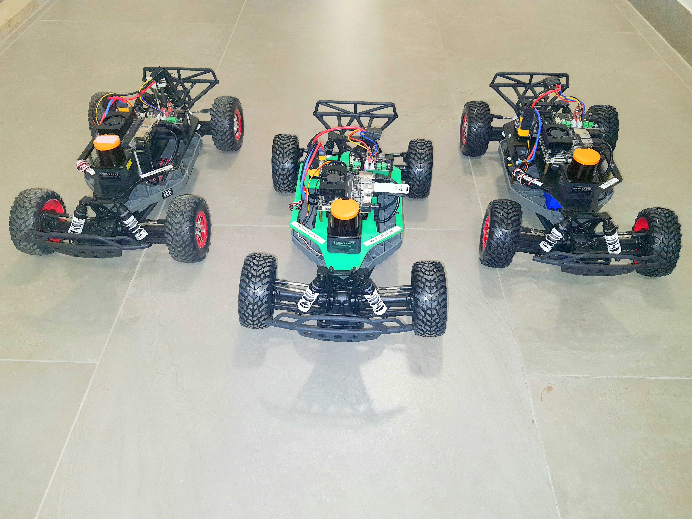
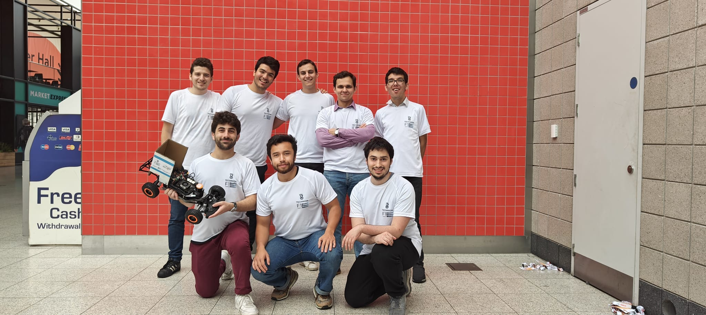

Our lab hosts and mentors the Technion [F1TENTH](https://f1tenth.org) team who build, develop, and race the autonomous racecar in international events.

F1TENTH is an international community of researchers, engineers, and autonomous systems enthusiasts founded at the University of Pennsylvania in 2016. F1TENTH’s mission is to provide an open-source platform for autonomous systems research and education, along with holding a number of autonomous race car competitions each year where teams from all around the world gather to compete. The Technion F1TENTH Team was launched in October 2022 under the supervision of Dr. Kiril Solovey of the Technion’s Electrical & Computer Engineering Faculty, in order to conduct research in autonomous racing and participate in international racing competitions. The team has a fleet of four cars. We competed for the first time in the 11th F1TENTH Autonomous Grand Prix competition, held at the ICRA 2023 conference in London in May 2023. The team has also participated in the 14TH Autonomous Grand Prix held in IROS in Detroit in October 2023. 

The team is composed of undergraduate and graduate students from different faculties in the Technion. It is currently subdivided into three teams. The planning and control team works on implementing algorithms to generate and execute dynamically feasible paths at the edge of vehicle dynamics. The perception team focuses on implementing robust perception algorithms leveraging the onboard LIDAR and Camera. The hardware team works on the hardware of the cars: from tuning the different parameters to ensure proper odometry and mapping to acquiring relevant information to create kinematic and dynamic models. They also assist in testing the different solutions. 

## 2023/24
<ul>
  <li>
    <strong>Eyal Kaldor</strong> - Hardware Engineer - B.Sc. Mechanical Engineering
    <a href="http://www.linkedin.com/in/eyal-kaldor-a4a7801b8">LinkedIn</a> 
    </li>
  <!-- Repeat the <li> block for each team member -->
</ul>

<ul>
  <li>
    <strong>João Felipe Gueiros</strong> - Hardware Engineer - B.Sc. student in Mechanical Engineering
    <a href="https://il.linkedin.com/in/jo%C3%A3o-felipe-gueiros-215a111a0">LinkedIn</a>
  </li>
  <!-- Repeat the <li> block for each team member -->
</ul>

<ul>
  <li>
    <strong>Marwan Sariya</strong> - Hardware Engineer - B.Sc. student in Electrical and Computer Engineering
    <!-- <a href="https://www.linkedin.com/in/janedoe">LinkedIn</a> | <a href="http://janedoe.com">Website</a> -->
  </li>
  <!-- Repeat the <li> block for each team member -->
</ul>

<ul>
  <li>
    <strong>Yuval Goshen</strong> - Perception - B.Sc. in Computer Engineering,
    <a href="https://linkedin.com/in/yuval-goshen-a8390b1ba">LinkedIn</a> | <a href="https://yuvalgos.github.io/">Website</a>
  </li>
  <!-- Repeat the <li> block for each team member -->
</ul>

<ul>
  <li>
    <strong>Golan Gershonowitz</strong> - Perception - B.Sc. student in Electrical and Computer Engineering
    <a href="https://www.linkedin.com/in/golanger">LinkedIn</a>
  </li>
  <!-- Repeat the <li> block for each team member -->
</ul>

<ul>
  <li>
    <strong>Toam Elharar</strong> - Perception - B.Sc. student in Computer Engineering
    <!-- <a href="https://www.linkedin.com/in/janedoe">LinkedIn</a> | <a href="http://janedoe.com">Website</a> -->
  </li>
  <!-- Repeat the <li> block for each team member -->
</ul>

<ul>
  <li>
    <strong>Dolev Freund</strong> - Planning and Control - B.Sc. in Mechanical Engineering 
    <a href="https://www.linkedin.com/in/dolev-freund-658447250/">LinkedIn</a>
  </li>
  <!-- Repeat the <li> block for each team member -->
</ul>

<ul>
  <li>
    <strong>Snir Carmeli</strong> - Planning and Control - B.Sc. in Mechanical Engineering
    <a href="https://www.linkedin.com/in/snir-carmeli-39a41a20a/">LinkedIn</a>
  </li>
  <!-- Repeat the <li> block for each team member -->
</ul>

<ul>
  <li>
    <strong>Orr Steinhart</strong> - Planning and Control - B.Sc. student Mechanical Engineering
    <!-- <a href="https://www.linkedin.com/in/snir-carmeli-39a41a20a/">LinkedIn</a> | <a href="http://janedoe.com">Website</a> -->
  </li>
  <!-- Repeat the <li> block for each team member -->
</ul>

<ul>
  <li>
    <strong>Ori Razon</strong> - Planning and Control - B.Sc. student in Electrical and Computer Engineering
    <a href="https://www.linkedin.com/in/ori-razon-2a561b223/">LinkedIn</a> 
  </li>
  <!-- Repeat the <li> block for each team member -->
</ul>

<ul>
  <li>
    <strong>Ofir Elyashiv</strong> - Planning and Control - B.Sc. student in Electrical and Computer Engineering
    <!-- <a href="https://www.linkedin.com/in/ori-razon-2a561b223/">LinkedIn</a>  -->
  </li>
  <!-- Repeat the <li> block for each team member -->
</ul>

<ul>
  <li>
    <strong>Andres Kaminker</strong> - Team Leader - B.Sc. student in Mechanical Engineering
    <a href="https://www.linkedin.com/in/andres-kaminker/">LinkedIn</a> 
  </li>
  <!-- Repeat the <li> block for each team member -->
</ul>

## 2022/23

<ul>
  <li>
    <strong>Yotam Granov</strong> - Planning and Control - B.Sc. in Mechanical Engineering and Phyisics
    <a href="https://www.linkedin.com/in/yotamgranov/">LinkedIn</a> 
  </li>
  <!-- Repeat the <li> block for each team member -->
</ul>

<ul>
  <li>
    <strong>Alexander Furman</strong> - Planning and Control - B.Sc. in Mechanical Engineering
    <a href="https://www.linkedin.com/in/alexander-furman/">LinkedIn</a> 
  </li>
  <!-- Repeat the <li> block for each team member -->
</ul>

<ul>
  <li>
    <strong>Aron Klevansky</strong> - Planning and Control - B.Sc. student in Mechanical Engineering
    <!-- <a href="https://www.linkedin.com/in/andres-kaminker/">LinkedIn</a>  -->
  </li>
  <!-- Repeat the <li> block for each team member -->
</ul>

<ul>
  <li>
    <strong>David Calderon</strong> - Perception & Vision - B.Sc. Computer Engineering
    <a href="https://www.linkedin.com/in/david-calderon-910354173/">LinkedIn</a> 
  </li>
  <!-- Repeat the <li> block for each team member -->
</ul>

<ul>
  <li>
    <strong>Tobi Weinberg</strong> - Perception & Vision - Ph.D student in Computer Science 
    <a href="https://www.linkedin.com/in/tobias-weinberg/"> LinkedIn</a> | <a href="https://tobiwg.com/">Website</a>
  </li>
  <!-- Repeat the <li> block for each team member -->
</ul>

